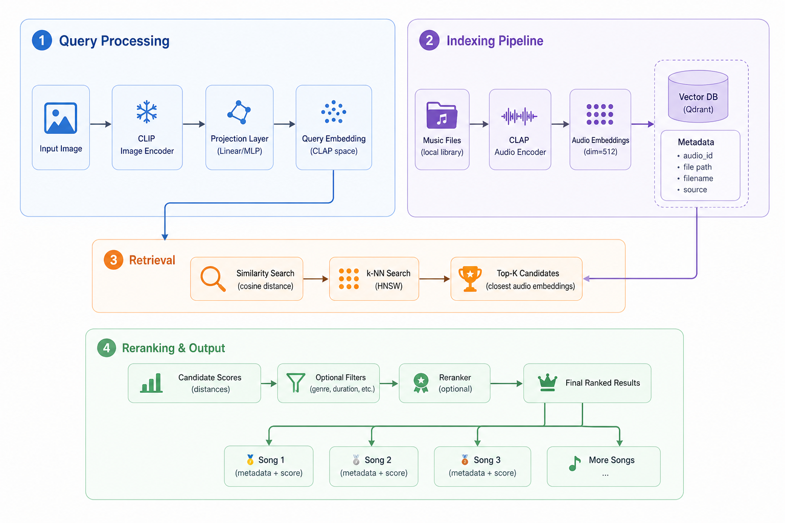

<div align="center">


# Reflectra

### Image-to-Music Retrieval with CLIP, CLAP, Qdrant, and Multimodal Embeddings

<p>
  <b>Upload an image. Understand its visual mood. Retrieve matching songs.</b>
</p>

<p>
  
  
  
  
  
</p>

</div>

## Architecture

<p align="center">
  
</p>

## Install

Requirements:

- Python 3.10+
- Docker, for local Qdrant
- Enough disk space for Qdrant storage, model caches, and downloaded audio clips

From the project root:

```bash
python -m venv .venv
source .venv/bin/activate
pip install -e .
```

Or let the setup script create the environment, install the package, and start services:

```bash
bash scripts/setup.sh
```

Useful service commands:

```bash
bash scripts/setup.sh start
bash scripts/setup.sh stop
bash scripts/setup.sh remove
```

`remove` deletes the local `qdrant_storage` directory, so use it only when you really want a clean vector DB.

## Configure

Defaults live in [configs/reflectra.toml](configs/reflectra.toml):

```toml
[qdrant]
url = "http://localhost:6333"
collection_name = "reflectra_music_clap"
vector_size = 512

[models]
clip = "openai/clip-vit-base-patch32"
clap = "laion/clap-htsat-unfused"
```

The bundled projection checkpoint is in [checkpoints/](checkpoints/).

## Use The App

Start Qdrant first:

```bash
bash scripts/setup.sh start
```

Start the backend plus GUI:

```bash
reflectra-gui --checkpoint checkpoints/reflectra_projection_flickr30k_1000.pt
```

The GUI lets you choose or drop an image, run search, then `Play` or `Save` a returned track. For study-indexed dataset tracks, playback downloads the source audio using metadata stored in Qdrant payloads:

- `source_dataset`
- `dataset_id`
- `audio_id`
- `captions`

Downloaded clips are saved under:

```text
data/study_downloaded_audio/
```

Command-line image search is also available:

```bash
reflectra-search path/to/image.jpg \
  --checkpoint checkpoints/reflectra_projection_flickr30k_1000.pt \
  --output result.json
```

## Observability


Reflectra can trace search stages as OpenTelemetry spans, export them to a local Jaeger UI,
and save per-stage timing JSON/PNG plots for quick performance checks.


`scripts/setup.sh` starts a local Jaeger container together with Qdrant:

```bash
bash scripts/setup.sh start
```

Check Jaeger in the browser:

```text
http://127.0.0.1:16686
```

Jaeger shows trace spans, not PNG plots. In the Jaeger UI, select the `reflectra` service, set the lookback window, then click `Find Traces`. A successful search request appears as `image_search` or `image_search_with_rerank`, with child spans such as `encode_query`, `check_db`, and `format_results`.

Run CLI search with tracing and timing outputs:

```bash
reflectra-search path/to/image.jpg \
  --checkpoint checkpoints/reflectra_projection_flickr30k_1000.pt \
  --jaeger \
  --timing-json plots/image_search.json \
  --timing-plot plots/image_search.png \
  --output result.json
```

Run the GUI/backend with Jaeger enabled:

```bash
reflectra-gui \
  --checkpoint checkpoints/reflectra_projection_flickr30k_1000.pt \
  --jaeger
```

Useful paths and services:

```text
Jaeger UI:       http://127.0.0.1:16686
Jaeger agent:    localhost:6831/udp
Timing plots:    plots/*.png
Timing JSON:     plots/*.json, or any path passed to --timing-json
Service name:    reflectra, override with --otel-service-name
```

If `--timing-plot` is passed without a path, Reflectra writes to:

```text
plots/image_search.png
plots/image_search_with_rerank.png
```

## Vector DB

For the large study vector DB, use the scripts and notes in [study/README.md](study/README.md).

Quick path:

```bash
bash study/fill_db.sh --target-samples 500000 --part-size 200
```

Create a portable snapshot:

```bash
python -m study.snapshot_vector_db create
```

Restore a snapshot:

```bash
python -m study.snapshot_vector_db restore data/vector_db/<snapshot>.tar.gz --force
```

## Benchmarks And Evaluation

Reflectra has two main retrieval evaluations:

- `Reflectra`: image-to-audio retrieval for the full system.
- `CLAP`: text-to-audio retrieval for the audio encoder baseline.

Both evaluation scripts download/unpack the prepared benchmark data before running metrics.

### Benchmarks Used

| Benchmark | Link | Size / structure | Used for |
|---|---:|---:|---|
| Reflectra image-to-audio benchmark | [Hugging Face](https://huggingface.co/datasets/AraNge/reflectra-benchmark) | Project benchmark generated from sampled Flickr30k image metadata and Song Describer audio metadata. The default generation script uses 1,000 images, 1,000 audios, and up to 6 candidate audios per image, producing up to 6,000 scored image-audio pairs. | Full image-to-audio Reflectra evaluation. |
| Reflectra CLAP benchmark | [Hugging Face](https://huggingface.co/datasets/AraNge/reflectra-clap-benchmark) | Project benchmark generated from Song Describer audio captions. The default generation script uses 100 audio samples and up to 6 candidate audios per caption query. | CLAP text-to-audio baseline evaluation. |
| CxC SITS labels | [GitHub](https://github.com/google-research-datasets/Crisscrossed-Captions) | CxC contains 247,315 human-labeled annotations over image-image, caption-caption, and image-caption pairs from MS-COCO Karpathy dev/test splits. | Optional CLIP image-caption evaluation. |

### Evaluate Reflectra

Run the full image-to-audio evaluation:

```bash
bash scripts/evaluate_reflectra.sh --checkpoint checkpoints/reflectra_projection_flickr30k_1000.pt
```

Output:

```text
evaluation_results/reflectra_eval_results.json
```

This evaluates image queries against candidate audio tracks. Relevance comes from the Reflectra benchmark scores. The evaluator reports:

- `ndcg@1`, `ndcg@5`, `ndcg@max-audios`
- `mrr`
- `mAP`
- `recall@1`, `recall@5`, `recall@max-audios`
- `precision@1`, `precision@5`, `precision@max-audios`

NDCG uses graded benchmark relevance. MRR, mAP, recall, and precision treat scores above the relevance threshold as relevant.

### Evaluate CLAP

Run the CLAP text-to-audio baseline:

```bash
bash scripts/evaluate_clap.sh
```

Output:

```text
evaluation_results/clap_eval_results.json
```

This evaluates CLAP caption queries against candidate audio tracks from the CLAP benchmark. It reports the same metric family:

- `ndcg@1`, `ndcg@5`, `ndcg@max-audios`
- `mrr`
- `mAP`
- `recall@1`, `recall@5`, `recall@max-audios`
- `precision@1`, `precision@5`, `precision@max-audios`

### Generate Benchmarks

Only regenerate benchmarks if you need new benchmark data.

Reflectra image-to-audio benchmark:

```bash
bash scripts/generate_dataset.sh --max-samples 6
```

CLAP caption-to-audio benchmark:

```bash
bash scripts/generate_clap_dataset.sh --audio-samples 100 --max-audios 6
```

Benchmark generation can resume existing shard files. It may require LLM settings in [configs/reflectra.toml](configs/reflectra.toml) or an `OPENAI_API_KEY`, depending on the backend you use for scoring.

## Datasets Used

Audio and music datasets:

| Dataset | Link | Size | Reflectra usage |
|---|---:|---:|---|
| MusicCaps | [Hugging Face](https://huggingface.co/datasets/google/MusicCaps) | 5,521 music examples, each with an aspect list and free-text caption; 10-second clips from AudioSet. | Clean caption-to-music reference data. |
| Song Describer Dataset | [Hugging Face](https://huggingface.co/datasets/renumics/song-describer-dataset), [paper](https://arxiv.org/abs/2311.10057) | 1.1k human-written descriptions for 706 music recordings. | Main captioned-song source for benchmark generation and study indexing. |
| MTG-Jamendo | [Hugging Face](https://huggingface.co/datasets/rkstgr/mtg-jamendo) | Over 55,000 full audio tracks with 195 genre, instrument, and mood/theme tags; train/validation split is 90/10. | Large Creative Commons music source for study indexing. |
| AudioSet | [Google Research](https://research.google.com/audioset/), [Hugging Face mirror](https://huggingface.co/datasets/agkphysics/AudioSet) | 2,084,320 human-labeled 10-second YouTube clips across hundreds of audio event classes. | Large weak-label audio source for study indexing. |

Image datasets:

| Dataset | Link | Size | Reflectra usage |
|---|---:|---:|---|
| Flickr30k | [Hugging Face](https://huggingface.co/datasets/nlphuji/flickr30k), [project page](https://shannon.cs.illinois.edu/DenotationGraph/) | 31,783 images and 158,915 crowd-sourced captions. | Projection training and image side of the Reflectra benchmark. |
| EmoSet mirror | [Hugging Face](https://huggingface.co/datasets/LiangJian24/EmoSet) | 4,100 rows in this HF mirror: 2,100 train and 2,000 test. | Image mood metadata experiments. |
| COCO 2014 / Karpathy metadata | [COCO](https://cocodataset.org/), [Karpathy metadata](http://cs.stanford.edu/people/karpathy/deepimagesent/coco.zip) | COCO image-caption data with Karpathy-style splits. | CLIP/CxC image-caption evaluation support. |

Most local dataset files are generated into `data/metadata/` or unpacked benchmark directories by the scripts above. The main app does not require downloading every dataset if you already have a Qdrant snapshot.

## Main Scripts

`scripts/setup.sh`

Creates `.venv` when missing, installs Reflectra in editable mode, starts Qdrant and Jaeger Docker containers, and prepares local directories.

```bash
bash scripts/setup.sh start
```

`scripts/train_proj.sh`

Trains the image-to-CLAP projection on Flickr30k metadata. It downloads the needed metadata if the local file is too small.

```bash
bash scripts/train_proj.sh -n 1000
```

`scripts/generate_dataset.sh`

Builds or resumes the Reflectra image-to-audio benchmark. Use this only when you need to regenerate benchmark data.

```bash
bash scripts/generate_dataset.sh --max-samples 6
```

`scripts/generate_clap_dataset.sh`

Builds or resumes the CLAP caption-to-audio benchmark.

```bash
bash scripts/generate_clap_dataset.sh --audio-samples 100 --max-audios 6
```

`scripts/evaluate_reflectra.sh`

Downloads/unpacks the Reflectra benchmark and evaluates the full image-to-audio system.

```bash
bash scripts/evaluate_reflectra.sh --checkpoint checkpoints/reflectra_projection_flickr30k_1000.pt
```

`scripts/evaluate_clap.sh`

Downloads/unpacks the CLAP benchmark and evaluates CLAP text-to-audio retrieval.

```bash
bash scripts/evaluate_clap.sh
```

`scripts/train_reranker.sh`

Trains a reranker on the Reflectra benchmark score table.

```bash
bash scripts/train_reranker.sh -p checkpoints/reflectra_projection_flickr30k_1000.pt
```

## Outputs

Common generated paths:

```text
qdrant_storage/                 Local Qdrant database
data/vector_db/                 Vector DB snapshots
data/study_audio_parts/         Study indexing state
data/study_downloaded_audio/    GUI-downloaded playable clips
evaluation_results/             Evaluation JSON outputs
plots/                          Optional timing plots
```

## Troubleshooting

If Qdrant is not reachable:

```bash
docker ps -a
docker logs reflectra-qdrant
bash scripts/setup.sh start
```

If the GUI finds tracks but `Play` fails, first try `Save`. Dataset downloads may require network access and Hugging Face cache availability. Saved audio files can still be opened directly from `data/study_downloaded_audio/`.
