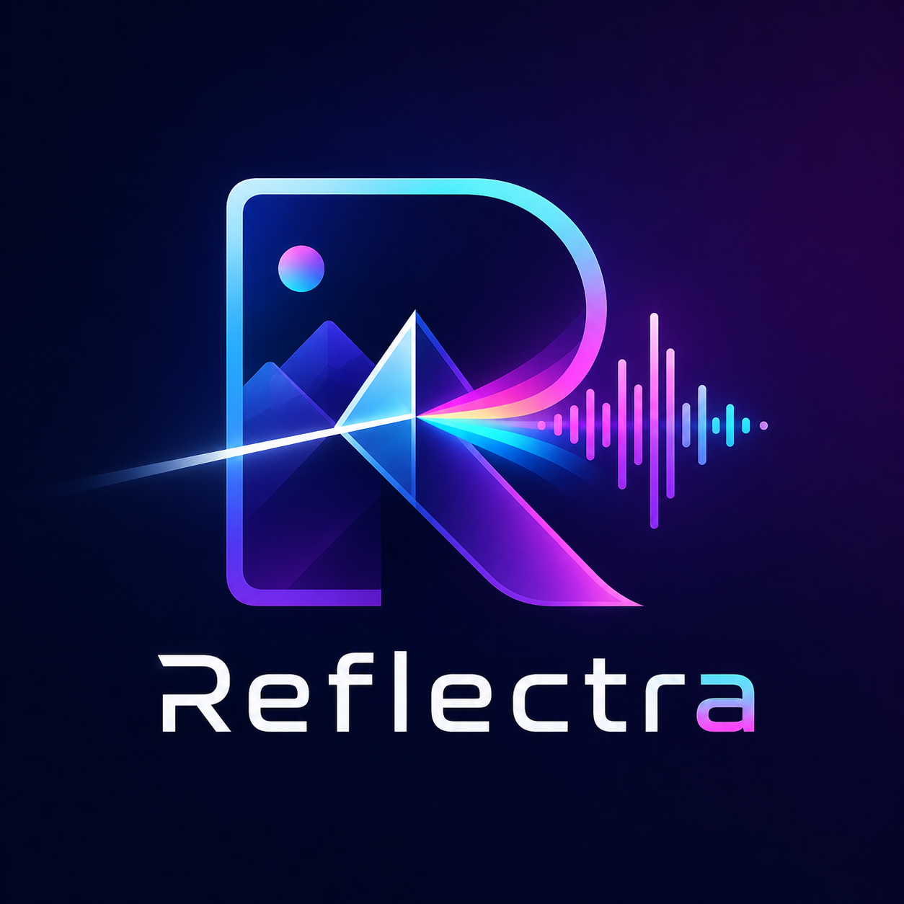

<div align="center">



# Reflectra

### Image-to-Music Retrieval with CLIP, CLAP, Qdrant, and Multimodal Embeddings

<p>
  <b>Upload an image. Understand its visual mood. Retrieve matching songs.</b>
</p>

<p>
  
  
  
  
</p>

</div>


---

## Overview

Reflectra is a multimodal retrieval system for recommending songs from an input image. The project does not generate music. Instead, it maps images, text descriptions, and audio clips into compatible embedding spaces and retrieves the closest matching audio tracks.

The final goal is:

```text
image
↓
CLIP image encoder
↓
image-to-CLAP projection layer
↓
CLAP embedding space
↓
Qdrant vector search over CLAP audio embeddings
↓
ranked songs
```

The first practical MVP can be simpler:

```text
image
↓
image caption / mood query
↓
CLAP text encoder
↓
Qdrant search over CLAP audio embeddings
↓
ranked songs
```

---

## Architecture

### 1. Text-to-Audio Retrieval

Text-to-audio retrieval is the first baseline. It checks whether pretrained CLAP can retrieve the correct audio clip from a natural language music description.

```text
caption: "happy energetic pop song with female vocals"
        ↓
CLAP text encoder
        ↓
text embedding

song.wav
        ↓
CLAP audio encoder
        ↓
audio embedding

similarity = cosine(text embedding, audio embedding)
```

This stage is used to evaluate CLAP before any image-based retrieval is added.

### 2. Image-to-Text Retrieval

Image-to-text retrieval evaluates the visual side using CLIP.

```text
image
↓
CLIP image encoder
↓
image embedding

caption / music query
↓
CLIP text encoder
↓
text embedding

similarity = cosine(image embedding, text embedding)
```

This stage answers whether CLIP understands image captions, scenes, and mood-related text well enough for the project.

### 3. Image-to-Audio Retrieval

The advanced system maps images into the CLAP audio-text space.

```text
image
↓
CLIP image encoder
↓
projection layer
↓
CLAP-compatible embedding
↓
Qdrant search over CLAP audio embeddings
↓
songs
```

The projection layer is trained first while CLIP and CLAP remain frozen.

Recommended projection design:

```text
Linear(CLIP dimension → hidden dimension)
GELU
LayerNorm
Dropout
Linear(hidden dimension → CLAP dimension)
L2 normalization
```

---

## Datasets

Downloaded files should live in the top-level `data/` directory. Python code for loading and downloading datasets should live under `src/datasets/`.

### Audio-text datasets

| Dataset | Main use | Notes |
|---|---|---|
| MusicCaps | Clean text-to-audio evaluation | Human-written music captions and aspect lists. Best clean benchmark for CLAP retrieval. |
| Song Describer Dataset | Clean text-to-audio evaluation | Useful for song-level natural language descriptions when captions are available. |
| MTG-Jamendo | Training / validation / scale evaluation | Contains audio plus metadata such as moods, genres, and instruments. |
| AudioSet | Large-scale weak evaluation / robustness | General audio dataset. Useful for scale and hard negatives, but not a clean song-caption benchmark. |
| LP-MusicCaps-MSD | Optional large caption dataset | Use only for audio retrieval if local audio files exist. Otherwise use captions as metadata only. |

### Image-text datasets

| Dataset | Main use | Notes |
|---|---|---|
| COCO Captions | Image-text training and validation | General image-caption alignment. |
| Flickr30k | Clean image-text evaluation | Good benchmark for image-caption retrieval. |
| EmoSet | Image mood/music-query training | Converts visual emotion into music-oriented text queries. |

---

## Project Structure

Recommended structure:

```text
reflectra/
├── assets/
│   └── logo.png
├── data/
│   ├── audio/
│   ├── images/
│   ├── metadata/
│   ├── embeddings/
│   └── hf_cache/
├── results/
├── scripts/
│   └── setup_environment.sh
├── src/
│   ├── datasets/
│   │   ├── downloaders/
│   │   ├── loaders/
│   │   └── preprocessing/
│   ├── evaluation/
│   │   ├── evaluate_clap.py
│   │   ├── evaluate_clip.py
│   │   └── evaluate_clap_qdrant.py
│   ├── metrics/
│   │   └── retrieval_metrics.py
│   ├── models/
│   │   ├── clap_encoder.py
│   │   ├── clip_encoder.py
│   │   └── image_to_clap_projection.py
│   └── vector_db/
│       ├── qdrant_store.py
│       └── index_clap_audio_qdrant.py
├── pyproject.toml
└── README.md
```

Recommended data layout:

```text
data/
├── audio/
│   ├── musiccaps/
│   ├── audioset/
│   ├── mtg_jamendo/
│   └── song_describer/
├── images/
│   ├── coco_captions/
│   ├── flickr30k/
│   └── emoset/
├── metadata/
│   ├── musiccaps_metadata.jsonl
│   ├── audioset_metadata.jsonl
│   ├── song_describer_metadata.jsonl
│   ├── mtg_jamendo_train_metadata.jsonl
│   ├── mtg_jamendo_validation_metadata.jsonl
│   ├── coco_captions_metadata.jsonl
│   ├── flickr30k_metadata.jsonl
│   ├── emoset_train_metadata.jsonl
│   └── emoset_test_metadata.jsonl
└── embeddings/
```

If your current scripts read metadata directly from `data/musiccaps_metadata.jsonl`, keep that layout or update the default paths inside the evaluation scripts.

---

## Installation

This project uses `pyproject.toml`, so install it as a package from the project root.

### 1. Create environment

```bash
python -m venv .venv
source .venv/bin/activate
```

On Windows PowerShell:

```powershell
python -m venv .venv
.venv\Scripts\Activate.ps1
```

### 2. Install package

Basic install:

```bash
pip install -e .
```

Install with development/data dependencies:

```bash
pip install -e .[dev]
```

The editable install is important because commands like this use imports from `src/`:

```bash
python -m src.evaluation.evaluate_clap
```

### 3. Run setup script

```bash
bash scripts/setup_environment.sh
```

The setup script creates project directories, installs the package in editable mode, pulls the Qdrant Docker image, and starts a local Qdrant container.

---

## Qdrant Setup

Qdrant is used to store CLAP audio embeddings and perform fast approximate nearest-neighbor search.

Default local URL:

```text
http://localhost:6333
```

Start Qdrant manually:

```bash
docker run -d \
  --name reflectra-qdrant \
  -p 6333:6333 \
  -p 6334:6334 \
  -v "$(pwd)/qdrant_storage:/qdrant/storage" \
  qdrant/qdrant:latest
```

Stop Qdrant:

```bash
docker stop reflectra-qdrant
```

Start an existing Qdrant container again:

```bash
docker start reflectra-qdrant
```

---

## Download Data

Examples:

```bash
python -m src.datasets.downloaders.download_musiccaps --number 100
python -m src.datasets.downloaders.download_audioset --number 100
python -m src.datasets.downloaders.download_mtg_jamendo --split train --number 100
python -m src.datasets.downloaders.download_mtg_jamendo --split validation --number 100
python -m src.datasets.downloaders.download_coco_captions --split train --number 100
python -m src.datasets.downloaders.download_flickr30k --number 100
python -m src.datasets.downloaders.download_emoset --split train --number 100
python -m src.datasets.downloaders.download_emoset --split test --number 100
```

Start small first. Verify metadata and file paths before downloading large datasets.

---

## Evaluation

There are two evaluation modes:

1. Dense local evaluation.
2. Qdrant-based retrieval evaluation.

Dense evaluation is useful for small clean benchmarks. Qdrant evaluation is required for large-scale retrieval because a full `500000 × 500000` similarity matrix is not practical.

---

### 1. Evaluate CLAP: Text-to-Audio

This evaluates whether CLAP can retrieve the correct audio from a text description.

```bash
python -m src.evaluation.evaluate_clap --max-samples 1000
```

Use selected dataset fractions:

```bash
python -m src.evaluation.evaluate_clap \
  --dataset-fractions "google/MusicCaps=1.0,agkphysics/AudioSet=0.5,rkstgr/mtg-jamendo=0.8" \
  --max-samples 50000
```

Use exact dataset counts:

```bash
python -m src.evaluation.evaluate_clap \
  --dataset-counts "google/MusicCaps=5000,rkstgr/mtg-jamendo=10000,agkphysics/AudioSet=20000"
```

The script computes:

```text
text → audio
 audio → text
```

Typical metrics:

```text
Recall@1
Recall@5
Recall@10
MRR
Median Rank
Mean Rank
```

---

### 2. Evaluate CLIP: Image-to-Text

This evaluates whether CLIP retrieves matching captions or music mood queries for images.

```bash
python -m src.evaluation.evaluate_clip --max-samples 1000
```

Use selected dataset fractions:

```bash
python -m src.evaluation.evaluate_clip \
  --dataset-fractions "whyen-wang/coco_captions=0.5,nlphuji/flickr30k=0.8,LiangJian24/EmoSet=1.0" \
  --max-samples 50000
```

Use exact dataset counts:

```bash
python -m src.evaluation.evaluate_clip \
  --dataset-counts "whyen-wang/coco_captions=5000,nlphuji/flickr30k=1000,LiangJian24/EmoSet=1000"
```

The script computes:

```text
image → text
text → image
```

---

### 3. Index Audio in Qdrant

Before Qdrant evaluation, index audio embeddings:

```bash
python -m src.vector_db.index_clap_audio_qdrant \
  --collection-name reflectra_audio_clap \
  --max-samples 10000
```

For full indexing:

```bash
python -m src.vector_db.index_clap_audio_qdrant \
  --collection-name reflectra_audio_clap
```

Each indexed audio point should contain payload fields like:

```json
{
  "audio_id": "...",
  "audio_path": "...",
  "text": "...",
  "source_dataset": "...",
  "split": "..."
}
```

---


## Metrics

For one-correct-target evaluation, Recall@K can be computed as whether the correct item appears in the top K.

For professional retrieval evaluation with multiple relevant items, use:

```text
Recall@K = number of relevant retrieved items in top K / total number of relevant items
Precision@K = number of relevant retrieved items in top K / K
HitRate@K = 1 if at least one relevant item is in top K, else 0
MRR = reciprocal rank of the first relevant result
MAP@K = average precision over the ranked top K list
NDCG@K = ranking quality with stronger reward for relevant items near the top
```

Recommended reporting:

```text
Text-to-audio:
- Recall@1
- Recall@5
- Recall@10
- MRR
- NDCG@10

Image-to-text:
- Recall@1
- Recall@5
- Recall@10
- MRR

Image-to-music final system:
- Precision@10 by mood/genre metadata
- NDCG@10
- Human rating from 1 to 5
- Percentage of recommendations rated 4 or 5
```

---

## Recommended Experiments

### Experiment 1: CLAP zero-shot baseline

```bash
python -m src.evaluation.evaluate_clap --max-samples 1000
```

Purpose:

```text
Measure pretrained CLAP before fine-tuning.
```

### Experiment 2: CLIP image-text baseline

```bash
python -m src.evaluation.evaluate_clip --max-samples 1000
```

Purpose:

```text
Measure whether CLIP aligns images with captions and music-oriented mood queries.
```

---

## Development Order

Recommended order:

```text
1. Install the project with pyproject.toml.
2. Start Qdrant.
3. Download a small sample from each dataset.
4. Run CLAP dense evaluation.
5. Run CLIP dense evaluation.
6. Index CLAP audio embeddings in Qdrant.
7. Run CLAP Qdrant evaluation.
8. Scale to larger samples.
9. Train image-to-CLAP projection only after baselines work.
10. Build final image-to-song demo.
```

---

## Notes

- Do not train from scratch at the beginning.
- Always evaluate pretrained CLAP first.
- Keep MusicCaps and Song Describer mainly for clean testing.
- Use MTG-Jamendo for training, validation, and scale experiments.
- Use AudioSet carefully because it is weakly labeled general audio, not a clean music-caption dataset.
- Use COCO and Flickr30k for image-caption evaluation.
- Use EmoSet for image mood/music-query alignment.
- Use Qdrant only after small local retrieval works correctly.
